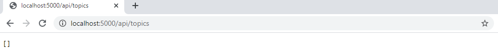
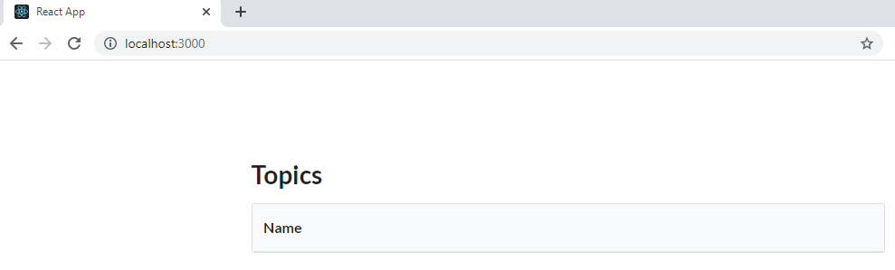
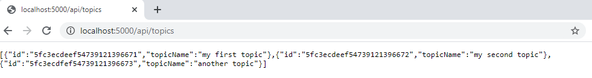
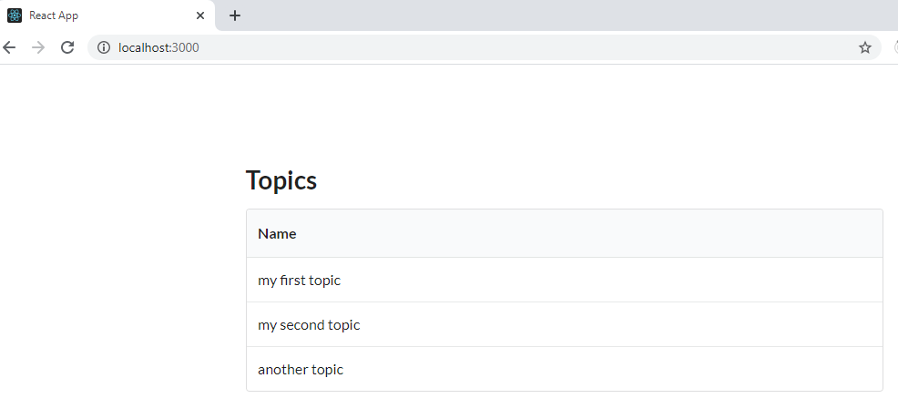

# devops-exercises

## Contenedores Ejercicio 1

- Crear una red llamada lemoncode-challenge:

```bash
docker network create lemoncode-challenge
```

- Crear un mongo asociado a la red lemoncode-challenge

```bash
docker run --name mongodb -p 27017:27017 -d --network lemoncode-challenge --mount source=my-mongo-data,target=/data/db mongo
```

- Accedemos a la base de datos creada usando mongoDBCompass para comprobar que la base de datos está creada en la url:

```bash
mongodb://localhost:27017
```

- Generar el [Dockerfile](https://github.com/igoralvarez/devops-exercises/blob/main/docker-exercises/lemoncode-challenge/backend/backend/Dockerfile) para el backend:

```bash
FROM mcr.microsoft.com/dotnet/core/sdk:3.1 AS build
WORKDIR /app
COPY ["backend.csproj", "./"]
RUN dotnet restore "./backend.csproj"
COPY . .
RUN dotnet publish "backend.csproj" -c Release -o out

FROM mcr.microsoft.com/dotnet/core/aspnet:3.1
WORKDIR /app
EXPOSE 80
ENV MONGO_URI mymongouri
COPY --from=build /app/out .
ENTRYPOINT ["dotnet", "backend.dll"]
```

- Lanzar la instrucción para construir la imagen del backend:

```bash
docker build . -t backend
```

- Ejecutar la imagen metiéndolo en la red lemoncode-challenge y pasando la url de la base de datos:

```bash
docker run -d --name my-backend --network lemoncode-challenge -p 5000:80 -e "MONGO_URI=mongodb://mongodb:27017" backend
```

- Si accedemos a la url http://localhost:5000/api/topics vemos que esta respondiendo con una lista vacía:



- Comprobar la red lemoncode-challenge para comprobar que tenemos el mongo y el backend en la misma red:

```bash
docker inspect lemoncode-challenge
```

- Para hacer la imagen del front. Creamos un [Dockerfile](https://github.com/igoralvarez/devops-exercises/blob/main/docker-exercises/lemoncode-challenge/frontend/Dockerfile) para el front:

```bash
FROM node:latest
WORKDIR /app
COPY ["package.json", "package-lock.json*", "npm-shrinkwrap.json*", "./"]
ENV NODE_ENV production
ENV REACT_APP_API_URL http://localhost:5000/api/topics
RUN npm install --production --silent && mv node_modules ../
COPY . .
EXPOSE 3000
CMD ["npm", "start"]
```

- Lanzar la instrucción para construir la imagen del frontend:

```bash
docker build . --tag=frontend
```

- Crear un contenedor del frontend:

```bash
docker run -d --name my-frontend -p 3000:3000 frontend
```

- Al acceder a localhost:3000 se ve la página de front levantada sin datos:
  

- Nos conectamos a la base de datos:

```bash
docker exec -it mongodb mongo
```

- Introducimos unos datos en la base de datos:

```bash
use TopicstoreDb
db.Topics.insert({
    Name: "my first topic"
})
db.Topics.insert({
    Name: "my second topic"
})
db.Topics.insert({
    Name: "another topic"
})
```

- Al llamar al servicio se ve que devuelve los nuevos datos.
  
- Al refrescar la aplicación se muestran los nuevos datos.
  

## Contenedores Ejercicio 2

Creamos el siguiente [docker-compose.yml](https://github.com/igoralvarez/devops-exercises/blob/main/docker-exercises/lemoncode-challenge/docker-compose.yml) :

```bash
version: "3.8"
services:
  database:
    image: mongo
    container_name: mongodb
    volumes:
      - my-mongo-data:/data/db
    restart: always
    networks:
      - lemoncode-challenge
  backend:
    depends_on:
      - database
    image: backend
    container_name: my-backend
    ports:
      - "5000:80"
    restart: always
    environment:
      - MONGO_URI=mongodb://mongodb:27017
    networks:
      - lemoncode-challenge
  frontend:
    image: frontend
    container_name: my-frontend
    ports:
      - "3000:3000"
volumes:
  my-mongo-data:
networks:
  lemoncode-challenge:

```

Levantamos el entorno:
```bash
docker-compose up -d
```

- Comprobamos que tenemos el mongo y el backend en la misma red:

```bash
docker inspect lemoncode-challenge_lemoncode-challenge
```

- También se ha creado una red "lemoncode-challenge_default". Si inspeccionamos esa red vemos que en esa red está incluido el front al que no le habiamos asignado ninguna red.

- Si accedemos a la url http://localhost:5000/api/topics vemos que esta respondiendo con una lista vacía:


- Al acceder a localhost:3000 se ve el front levantado sin datos:
  

- Al igual que antes nos conectamos a la base de datos y añadimos algunos datos:

```bash
docker exec -it mongodb mongo
```

- Al llamar al servicio se ve que devuelve los nuevos datos.
  
- Al refrescar la aplicación se muestran los nuevos datos.
  

Para parar el entorno lanzamos:
```bash
docker-compose stop
```

Para eliminarlo junto con los volumenes asociados lanzamos:
```bash
docker-compose down -v
```
