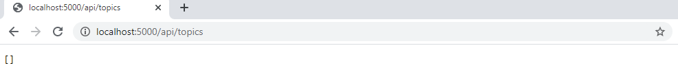
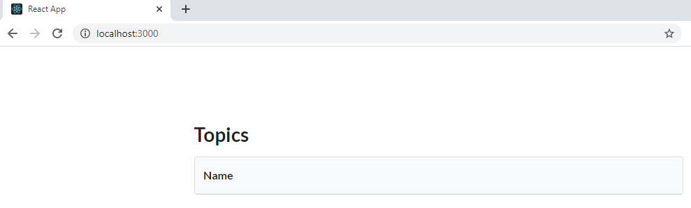
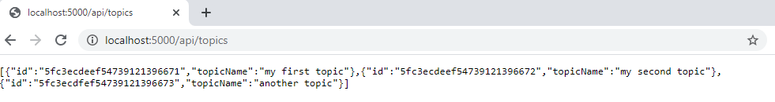
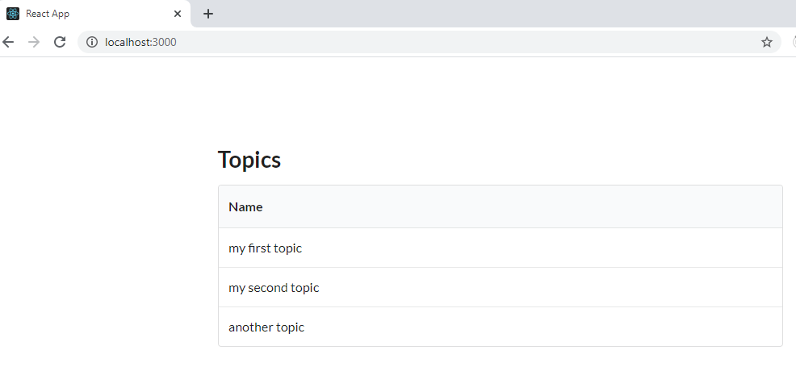

# devops-exercises

## Contenedores Ejercicio 1

- Crear una red llamada lemoncode-challenge:

```bash
  docker network create lemoncode-challenge
```

- Crear un mongo asociado a la red lemoncode-challenge

```bash
  docker run --name mymongo -p 27017:27017 -d --network lemoncode-challenge --mount source=my-mongo-data,target=/data/db mongo
```

- Accedo a la base de datos creada usando mongoDBCompass para comprobar que la base de datos está creada en la url:

```bash
  mongodb://localhost:27017
```

- Generar el Dockerfile para el backend:

```bash
  FROM mcr.microsoft.com/dotnet/core/sdk:3.1 AS build
  WORKDIR /app
  ENV MONGO_URI mymongouri
  COPY ["backend.csproj", "./"]
  COPY . .
  RUN dotnet restore "./backend.csproj"
  RUN dotnet build "backend.csproj" -c Release -o out
  FROM build AS publish
  RUN dotnet publish "backend.csproj" -c Release -o out
  FROM mcr.microsoft.com/dotnet/core/aspnet:3.1
  WORKDIR /app
  EXPOSE 80
  COPY --from=publish /app/out .
  ENTRYPOINT ["dotnet", "backend.dll"]
```

- Lanzar la instrucción para construir la imagen del backend:

```bash
  docker build . -t backend
```

- Ejecutar la imagen metiendolo en la red lemoncode-challenge y pasando la url de la base de datos:

```bash
  docker run -d --name my-backend --network lemoncode-challenge -p 5000:80 -e "MONGO_URI=mongodb://mymongo:27017" backend
```

- Si accedo a la url http://localhost:5000/api/topics veo que esta respondiendo con una lista vacía:



- Comprobar la red lemoncode-challenge para comprobar que tenemos el mongo y el backend en la misma red:

```bash
  docker inspect lemoncode-challenge
```

- Para hacer la imagen del front. Creamos un Dockerfile del front:

```bash
  FROM node:latest
  WORKDIR /app
  COPY ["package.json", "package-lock.json*", "npm-shrinkwrap.json*", "./"]
  ENV NODE_ENV production
  ENV REACT_APP_API_URL http://localhost:5000/api/topics
  RUN npm install --production --silent && mv node_modules ../
  COPY . .
  EXPOSE 3000
  CMD ["npm", "start"]
```

- Lanzar la instrucción para construir la imagen del frontend:

```bash
  docker build . --tag=frontend
```

- Crear un contenedor del frontend:

```bash
  docker run -d --name my-frontend -p 3000:3000 frontend
```

- Al acceder a localhost:3000 se ve la página de front levantada sin datos:
  
- Me conecto al contenedor de la base de datos:

```bash
  docker exec -it mymongo mongo
```

- Introducimos unos datos en la base de datosdatos:

```bash
    use TopicstoreDb
    db.Topics.insert({
        Name: "my first topic"
    })
    db.Topics.insert({
        Name: "my second topic"
    })
    db.Topics.insert({
        Name: "another topic"
    })
```

- Al llamar al servicio se ve que devuelve los nuevos datos.
  
- Al refrescar la aplicación se muestran los nuevos datos.
  
